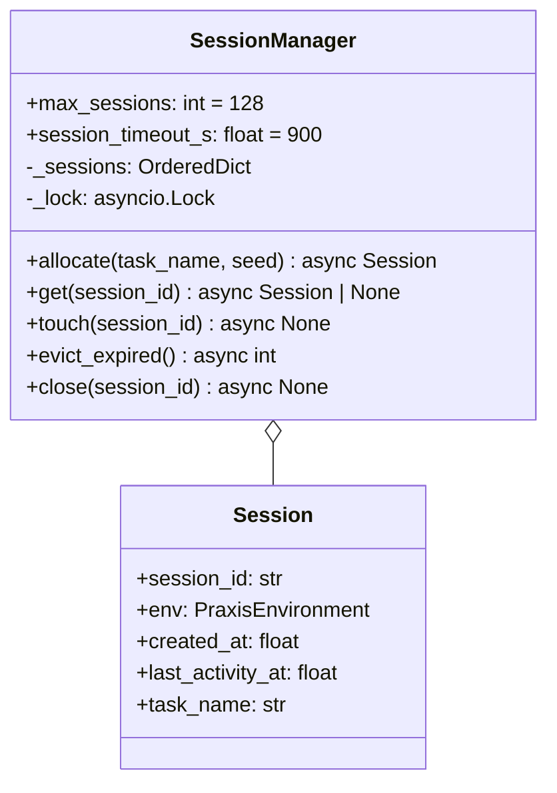

# Concurrency Model — Sessions, Locks, Eviction

> Removes the global `env = PraxisEnvironment()` singleton at
> [`server/app.py:46`](../../../server/app.py) so GRPO parallel rollouts and
> multiple judges can hit the same Space without state corruption.
>
> Mirrors OpenEnv's pattern in `OpenEnv/src/openenv/core/env_server/interfaces.py`
> (`SUPPORTS_CONCURRENT_SESSIONS`) and the factory style in
> `OpenEnv/src/openenv/cli/templates/openenv_env/server/app.py` (`create_app(..., max_concurrent_envs=N)`).

---

## 1. Why this is a P0 blocker

- TRL `GRPOTrainer` rolls out **N parallel completions per prompt** (`num_generations=8` is typical). Each rollout needs its own environment.
- The OpenEnv runtime validator may open multiple WebSocket / HTTP sessions and expects independent state per session.
- Without sessions, two parallel `/step` calls clobber `self._scenario._step_count` → non-deterministic rewards → judging disqualification (graders that always return same/wrong score).

---

## 2. Session manager



- `_sessions` is an `OrderedDict`; eviction policy is **LRU on access** (`move_to_end` on `get`/`touch`) **plus** TTL eviction on activity (`session_timeout_s`).
- A single **`asyncio.Lock`** guards mutations (Issue #22, ADR-16). Threading.Lock blocks the FastAPI event loop on contention; `asyncio.Lock` cooperatively yields.
- `max_sessions = 128` (tunable via `PRAXIS_MAX_SESSIONS` env var). At capacity the oldest session is `popitem(last=False)`-evicted before insertion.
- `session_timeout_s = 900` (15 min) — sessions idle beyond this are evicted on the next request; closes the leak path for abandoned MissionOps episodes that could otherwise hold 150-step state forever.

Why `asyncio.Lock` instead of `threading.Lock`:

- FastAPI runs route handlers on the event loop. `threading.Lock.acquire()` from inside an async handler **blocks the entire loop** during contention — every other request stalls.
- `asyncio.Lock` is acquired with `async with self._lock:` and yields control back to the loop while waiting.
- TRL `GRPOTrainer` issues 8 parallel rollouts; 8 threads contending for `threading.Lock` would serialise the whole training step. `asyncio.Lock` lets the I/O-bound `/step` work overlap.
- Source: `FlawsToProduction/Critical Mistakes (Real-World Failures).md` Mistake 4 ("Concurrency Locks Block the Event Loop").

---

## 3. Request routing

```mermaid
flowchart LR
    R[/POST /reset/] --> A[allocate_session]
    S[/POST /step/] --> H{X-Session-Id?}
    G[/GET /state/] --> H
    H -- present --> L[get(id)]
    H -- missing --> F[fallback: last session]
    L -- found --> Touch[touch(id) → run env.step]
    L -- not found --> Err400[400 No active session]
    F -- exists --> Touch
    F -- empty --> Err400
```

`/reset` is the only endpoint that **creates** a session. `/step` and `/state` only **look up**. The fallback path is a soft-deprecated bridge for judges that forget to forward the header; it logs a `WARN` and uses the most recently touched session.

---

## 4. FastAPI integration (Issue #22 — asyncio.Lock + TTL eviction + slowapi rate-limit)

`server/app.py` now swaps the module-level singleton for `SessionManager`, and `server/session_manager.py` provides allocation, lookup, touch, and close with `asyncio.Lock`-guarded mutations.

```python
import asyncio
import time
from collections import OrderedDict
from uuid import uuid4

class SessionManager:
    def __init__(
        self,
        max_sessions: int = 128,
        session_timeout_s: float = 900.0,
    ) -> None:
        self._sessions: OrderedDict[str, "Session"] = OrderedDict()
        self._lock = asyncio.Lock()
        self.max_sessions = max_sessions
        self.session_timeout_s = session_timeout_s

    async def allocate(self, task_name: str, seed: int | None) -> "Session":
        async with self._lock:
            await self._evict_expired_unlocked()
            if len(self._sessions) >= self.max_sessions:
                self._sessions.popitem(last=False)
            sid = str(uuid4())
            env = PraxisEnvironment()
            env.reset(task_name=task_name, seed=seed)
            sess = Session(
                session_id=sid,
                env=env,
                task_name=task_name,
                created_at=time.monotonic(),
                last_activity_at=time.monotonic(),
            )
            self._sessions[sid] = sess
            return sess

    async def get(self, sid: str | None) -> "Session | None":
        async with self._lock:
            await self._evict_expired_unlocked()
            if sid and sid in self._sessions:
                self._sessions.move_to_end(sid)
                self._sessions[sid].last_activity_at = time.monotonic()
                return self._sessions[sid]
            if not sid and self._sessions:
                # bridge mode — last session, logs WARN
                return next(reversed(self._sessions.values()))
            return None

    async def _evict_expired_unlocked(self) -> int:
        now = time.monotonic()
        cutoff = now - self.session_timeout_s
        expired = [sid for sid, s in self._sessions.items() if s.last_activity_at < cutoff]
        for sid in expired:
            del self._sessions[sid]
        return len(expired)

manager = SessionManager()
```

Route handlers become `async def` and `await manager.get(...)`.

### 4.1 Rate limiting with `slowapi` (Issue #22)

`slowapi` adds DoS protection without changing the FastAPI handler shape:

```python
# server/app.py
from slowapi import Limiter, _rate_limit_exceeded_handler
from slowapi.util import get_remote_address
from slowapi.errors import RateLimitExceeded

limiter = Limiter(key_func=get_remote_address, default_limits=["120/minute"])
app.state.limiter = limiter
app.add_exception_handler(RateLimitExceeded, _rate_limit_exceeded_handler)

@app.post("/step")
@limiter.limit("60/minute")
async def step(request: Request, body: PraxisAction) -> dict: ...

@app.post("/reset")
@limiter.limit("30/minute")
async def reset(request: Request, body: ResetRequest) -> dict: ...
```

Limits chosen so:

- An honest GRPO rollout with `num_generations=8` × ~150 turns / 5 min stays under 60/min/IP for `/step` (per-session, not global).
- `/reset` is the costlier operation (allocates an env); 30/min/IP gates accidental resets.
- Judge harness evaluating sequentially is well within budget.

Excess returns `429 Too Many Requests` with `Retry-After` header; not a DQ — judges' Phase-1 validation calls don't burst.

---

## 5. OpenEnv parity flags

The `PraxisEnvironment` class declares the OpenEnv-recognised flag so the validator and UI accept concurrent sessions:

```python
class PraxisEnvironment:
    SUPPORTS_CONCURRENT_SESSIONS: bool = True
    REQUIRES_SINGLE_THREAD_EXECUTOR: bool = False
```

`openenv.yaml` mirrors this at the manifest level:

```yaml
supports_concurrent_sessions: true
themes:
  - long-horizon-planning
```

---

## 6. Test obligations (Issue #22, expanded by #34)

A passing implementation must satisfy `tests/test_concurrent_sessions.py`:

- 8 parallel `/reset` calls (via `httpx.AsyncClient`) return 8 distinct `session_id` values.
- Each session can run a different task simultaneously without `step_number` drift.
- LRU eviction triggers exactly when the 129th session is allocated; the oldest session id no longer resolves.
- TTL eviction: a session idle for `session_timeout_s + 1` is evicted on the next request; further `/step` returns 400.
- `/step` with an unknown `X-Session-Id` returns 400 (no implicit session creation).
- 200 sequential `/step` calls under `asyncio.gather` complete inside the existing `< 20 min` runtime budget on `vCPU=2, memory=8gb`.
- `slowapi` rate-limit: 100 `/step` calls in 60s from the same IP yields some 429s; subsequent honest calls succeed once `Retry-After` elapses.

---

## 7. Out of scope (deliberately)

- WebSocket transport — Praxis stays HTTP-only for the hackathon. The OpenEnv `WSReset/Step/State` shapes are documented for future parity but not implemented.
- Distributed sessions across replicas — single-process for HF Spaces. If we ever scale out, sessions move to Redis behind the same `SessionManager` interface.
