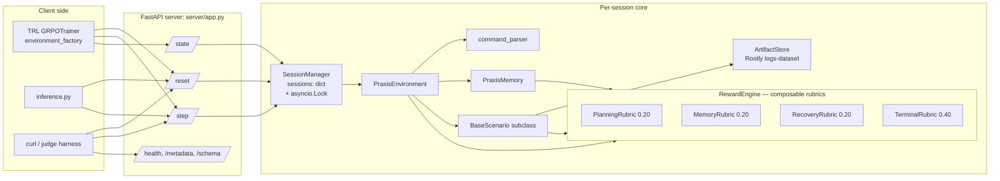
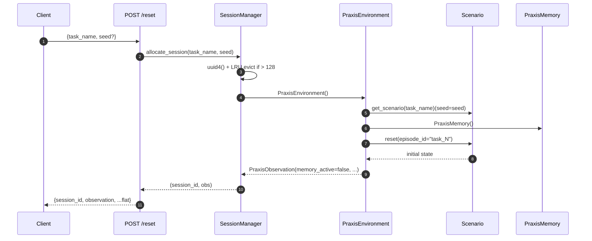
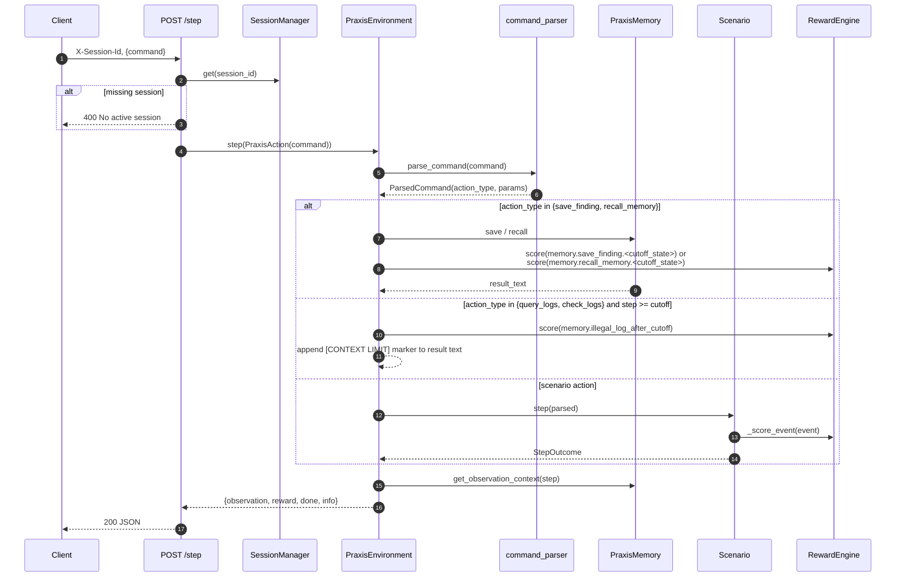
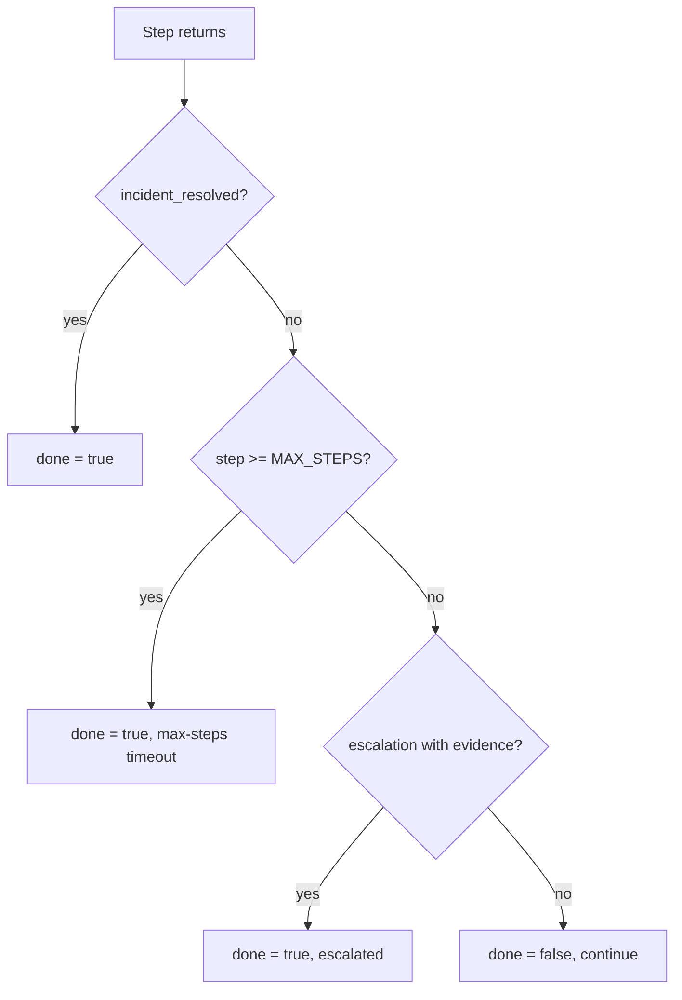
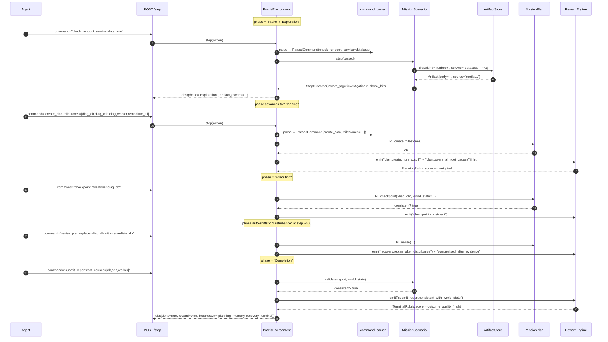
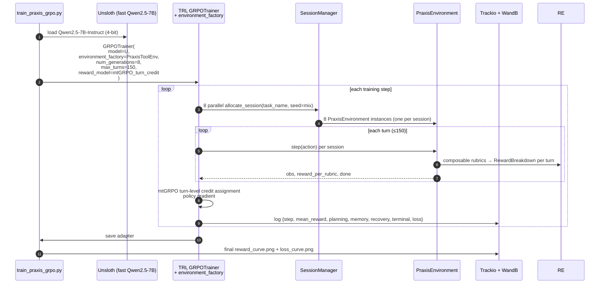

# Data Flow — End-to-End Praxis Trajectory

> Single-source diagrams that every issue can link to. Mirrors OpenEnv's
> `Environment / Action / Observation / State` contract from
> `OpenEnv/src/openenv/core/env_server/interfaces.py`.

---

## 1. Component map



---

## 2. Reset flow



Key invariants:

- `session_id` is a fresh UUID4 returned in the JSON body (not in a header).
- `seed` is forwarded only to scenarios that opt in (`procedural-incident`).
- Memory always resets in lockstep with the scenario.

---

## 3. Step flow (with memory branch)

Status: shipped in Issue #6 (`server/praxis_environment.py` + `server/session_manager.py`).



Observation rewrite rules (executed by `PraxisEnvironment.step`):

- If `step >= memory.CONTEXT_CUTOFF_STEP`, replace `observation.investigation_result` with `memory.get_observation_context(...)`.
- Always set `observation.memory_active = (step >= cutoff)`.
- Always set `observation.saved_findings_count = len(memory.saved_findings)`.

---

## 4. Reward composition (composable rubrics — RewardPolicy §8)

```mermaid
flowchart TD
    Event[Event tag emitted by scenario / memory / planner] --> Route{tag prefix?}
    Route -- "plan.* / checkpoint.*" --> PR[PlanningRubric 0.20]
    Route -- "memory.*" --> MR[MemoryRubric 0.20]
    Route -- "recovery.* / destructive_penalty" --> RR[RecoveryRubric 0.20]
    Route -- "diagnosis.* / remediation.* / submit_report.* / _resolved" --> TR[TerminalRubric 0.40]

    PR --> Comp[RewardBreakdown<br/>{planning, memory, recovery, terminal}]
    MR --> Comp
    RR --> Comp
    TR --> Comp

    Comp --> Step[subtract time_pressure_cost_per_step]
    Step --> Sum[weighted sum, weights == 1.0]
    Sum --> Clamp["clamp_reward → [0.01, 0.99]"]
    Clamp --> Out[per-turn reward + per-rubric breakdown]
    Out --> Score["compute_task_score = outcome_quality × (1 − steps/max_steps)<br/>(ADR-20 / Issue #23)"]
```

Memory events feed into `MemoryRubric` (see [`RewardPolicy.md`](./RewardPolicy.md) §1 + §8):

- `memory.save_finding.before_cutoff` → +0.05
- `memory.save_finding.after_cutoff` → +0.02
- `memory.recall_memory.before_cutoff` → +0.01
- `memory.recall_memory.after_cutoff` → +0.08
- `memory.illegal_log_after_cutoff` → −0.05 (log queries after cutoff)
- `memory.empty_recall_after_cutoff` → −0.02

Planning + Recovery + Terminal events are documented in [`RewardPolicy.md`](./RewardPolicy.md) §8 and `ScenarioCatalog.md` §3.6.

---

## 5. Episode terminator decision tree



Driven by `BaseScenario.is_done()` plus the memory-aware `PraxisEnvironment` wrapper.

---

## 6. Cross-doc links

- Endpoints / schemas: [`APIContract.md`](./APIContract.md)
- Sessions + locking: [`ConcurrencyModel.md`](./ConcurrencyModel.md)
- Memory tool design: [`MemoryModel.md`](./MemoryModel.md)
- Per-task reward maps: [`RewardPolicy.md`](./RewardPolicy.md)
- Scenario inventory: [`ScenarioCatalog.md`](./ScenarioCatalog.md)
- Reset/step/done lifecycle: [`SessionLifecycle.md`](./SessionLifecycle.md)

---

## 7. Planning-action sequence (MissionOps phases)

> Issue #25 introduces 5 new commands: `create_plan`, `revise_plan`, `checkpoint`, `submit_report`, `request_clarification`. They route through the same `command_parser` → `PraxisEnvironment.step` path, but their reward tags are read by `PlanningRubric` / `RecoveryRubric` / `TerminalRubric` (RewardPolicy §8).



Key invariants:

- `create_plan` is only reward-positive if emitted before `CONTEXT_CUTOFF_STEP` (`PlanningRubric` reads the cutoff).
- `revise_plan` is reward-positive only if (a) new evidence has arrived since last plan, OR (b) emitted in Recovery phase after disturbance.
- `submit_report` mismatching world state ⇒ `TerminalRubric.score=0` ⇒ outcome × efficiency = 0 (ADR-20).
- `request_clarification` is rate-limited at 1/episode and surfaces the next deterministic artifact for the same service (so it never makes the env non-deterministic).

---

## 8. Live training loop (Unsloth + mtGRPO, Issue #31)

> Replaces the old plain-TRL diagram. ADR-19 / S35.



What changes vs plain GRPO:

- **Per-turn credit**: each of the 4 rubrics emits a value per turn; mtGRPO uses these for turn-level advantage rather than only end-of-episode credit. Stable on sparse-reward MissionOps.
- **Throughput**: Unsloth ~2.5× faster than vanilla HF + Flash-Attn for the same context length, fitting Colab T4/A10G budgets.
- **Public artefacts**: Trackio (private team) + WandB **public run** (judge-readable). Both URLs in README + ReleasePackage.md.

Rollback path: if Unsloth incompatible with the chosen model, fall back to TRL GRPOTrainer with a `turn_reward_aggregator` shim that approximates mtGRPO. Documented in Issue #31 Implementation notes.
