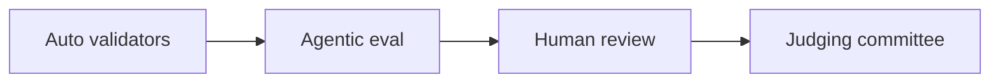

# Judge Persona — Who Reads Praxis and What They Care About

> Three concentric circles of judges, each with different priorities. Every PR
> description, README sentence, and demo beat should be tested against these.

---

## 1. The three concentric circles

| Circle | Who                                                             | What they decide                                                             |
| ------ | --------------------------------------------------------------- | ---------------------------------------------------------------------------- |
| 1      | OpenEnv runtime validator + ping bot                            | Auto pass/fail on `/health`, Dockerfile, `openenv validate`.                 |
| 2      | Standard open LLM (Nemotron 3 Super, etc.) re-running every env | Score variance check; graders that always return the same value get flagged. |
| 3      | Meta + Hugging Face engineers                                   | Judge **innovation, storytelling, evidence, pipeline coherence**.            |
| 4      | Final committee                                                 | Awards. Top 3 on the four-criterion rubric (40/30/20/10).                    |

Source: [`idea/PROBLEM STATEMENT/How Judging works.md`](../../PROBLEM%20STATEMENT/How%20Judging%20works.md).

---

## 2. The Meta engineer's mindset (verbatim from data)

From `idea/Task.md` line 100:

> _"build cool stuff — but it no needs be simple — this is a hackathon — the community, the world, or An Anthropic next opus mode needs to use our stuff to train their next model"_

What they look for, distilled:

1. **Could a researcher write a paper about training on this?** (Innovation.)
2. **Does the env teach the LLM something it currently can't do well?** (Capability gap.)
3. **Is the reward hard to game?** (Reward shaping quality.)
4. **Does the pipeline actually train, end to end?** (Evidence + reproducibility.)
5. **Would they show this to their team on Monday?** (Storytelling + finish.)

Source: external themes & criteria doc, "What makes a submission stand out".

---

## 3. Anti-patterns the panel is sick of

- Chess / snake / tic-tac-toe / grid-world clones.
- "We trained on a static dataset that we call an environment."
- One `if/else` reward function with binary output.
- Polished UI with no training evidence.
- Documentation that only describes the API; never explains the capability gap.

Source: external themes & criteria doc, "Pick an ambitious, original problem".

---

## 4. What we put in front of each circle

| Circle | What we ship                                                                                                                                               |
| ------ | ---------------------------------------------------------------------------------------------------------------------------------------------------------- |
| 1      | `/health` 200, Dockerfile builds, `openenv validate` PASS, `inference.py` runs without error.                                                              |
| 2      | 6 deterministic tasks, reward variance > 0.05 between random and prompted agent, runtime < 20 min.                                                         |
| 3      | The 60-90s pitch, the cutoff demo, the score gap table, the reward curve, the README that explains the moat in 3 minutes.                                  |
| 4      | Innovation = explicit memory-as-tool. Storytelling = the cutoff banner moment. Evidence = score gap + curve. Pipeline = TRL `environment_factory` snippet. |

---

## 5. Heuristics for any PR description

Before opening a PR, ask:

- [ ] Does this make Circle 1 (auto validators) **more** likely to pass?
- [ ] Does this preserve determinism for Circle 2 (agentic eval)?
- [ ] Does this give Circle 3 (humans) a sentence to quote in their review?
- [ ] Does this advance Innovation (40%) or Storytelling (30%) — not just polish?

If a PR fails 0/4, the lane reviewer (per `§4 Review policy` in the plan) should ask for rework.

---

## 6. The "Anthropic-trains-on-this" test

When in doubt, ask: _would Anthropic's next Opus team actually pull this env from the Hub to train on?_

If yes → ship it.
If no → re-scope the issue. The example issues (concurrency fix, memory cutoff, mega-incident, procedural generator, GRPO + curve) are all yes.
