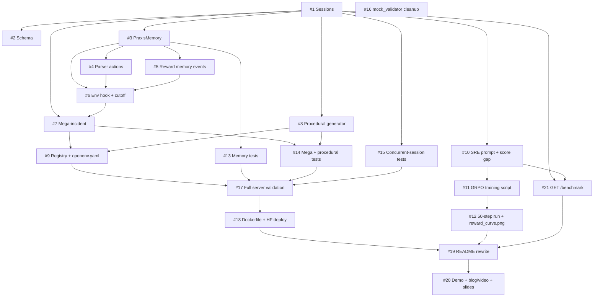
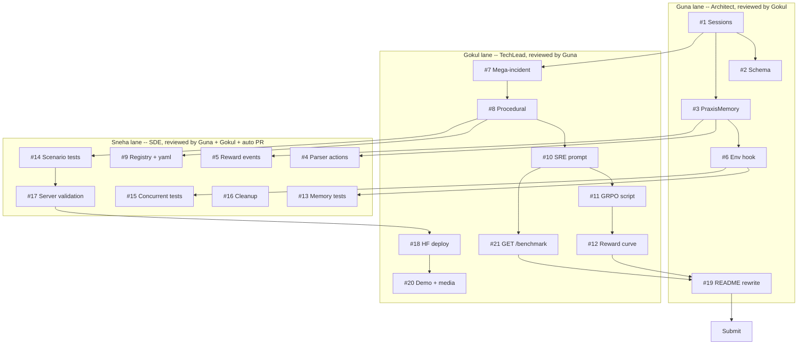

# Dependency Graph -- 21-Issue Wave Plan

> Three lanes (Guna / Gokul / Sneha) so the leads ship in parallel after #1
> lands. Quality > parallelism: a reviewer can hold a lane indefinitely. See
> `Project/DecisionLog.md` ADR-11 for the review policy.

---

## 1. Issue dependency DAG



---

## 2. Lane assignment (parallel-safe)



---

## 3. Critical path (single longest chain)

```
#1 -> #3 -> #6 -> #7 -> #9 -> #17 -> #18 -> #19 -> #20
```

Roughly 9 hours wall-clock with buffer. Anything off this chain is parallel-safe.

---

## 4. Wave-by-wave assignment table

| Wave | Time slot      | Guna (Architect)          | Gokul (TechLead)                  | Sneha (SDE)                        |
| ---- | -------------- | ------------------------- | --------------------------------- | ---------------------------------- |
| 1    | T+0:00 -> 1:00 | **#1 Sessions (BLOCKER)** | --                                | --                                 |
| 2    | T+1:00 -> 2:00 | #2 Schema                 | #7 Mega-incident (start)          | --                                 |
| 3    | T+2:00 -> 3:30 | #3 PraxisMemory           | #7 Mega-incident (finish)         | #4 Parser actions                  |
| 4    | T+3:30 -> 4:30 | #6 Env hook               | #8 Procedural generator           | #5 Reward events                   |
| 5    | T+4:30 -> 5:30 | --                        | #10 SRE prompt + score gap        | #9 Registry + yaml; #13 Mem tests  |
| 6    | T+5:30 -> 6:30 | --                        | #11 GRPO script                   | #14 Scenario tests; #15 Concurrent |
| 7    | T+6:30 -> 7:30 | --                        | #12 Reward curve (if GPU)         | #16 Cleanup; #17 Server validation |
| 8    | T+7:30 -> 8:30 | #19 README rewrite        | #18 HF deploy; #21 GET /benchmark | --                                 |
| 9    | T+8:30 -> 9:00 | --                        | #20 Demo + media                  | --                                 |

Sneha's PRs are reviewed by **both leads + auto PR review**; Guna's by Gokul; Gokul's by Guna.

`#21 GET /benchmark` is a thin read-only endpoint (depends on `#10` for `docs/baseline_scores.md` content and `#1` for the FastAPI app shape); it parallel-runs with `#18` in Gokul's Wave-8 tail and unblocks the README link block in `#19`. Quality > parallelism still applies.

---

## 5. Hard rules

- A PR cannot merge until its **Depends on** issues are closed.
- A PR cannot merge until required reviewers approve (per ADR-11).
- A PR cannot merge unless the **Plan docs to update** checklist in its body is satisfied (plan == reality).
- A PR cannot merge if it regresses the existing 289-test baseline.
