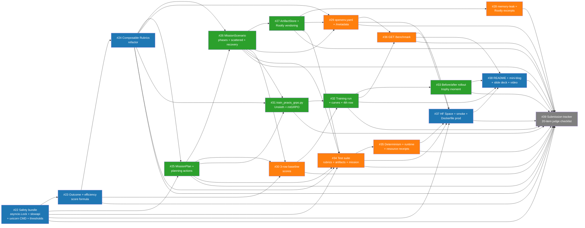

# Dependency Graph — Praxis MissionOps (Plan v3.0)

> 17 implementation issues `#22 → #38` + 1 tracker `#39`. Three lanes
> (Architect / TechLead / SDE) per ADR-11. Critical path = the longest
> Architect+TechLead chain through MissionOps + training + submission.

---

## 1. DAG (Mermaid)



---

## 2. Lane assignment + reviewers

ADR-11 review policy ([`Project/DecisionLog.md`](./Project/DecisionLog.md)). Reviewers auto-set by `.github/CODEOWNERS` + `.github/workflows/auto-review.yml`.

| Lane (owner)                       | Issues                              | Total | Reviewers              |
| ---------------------------------- | ----------------------------------- | ----- | ---------------------- |
| **Architect** (`@GunaPalanivel`)   | #22, #23, #24, #37, #38, #39        | 6     | TechLead               |
| **TechLead** (`@Gokul287`)         | #25, #26, #27, #31, #32, #33        | 6     | Architect              |
| **SDE** (`@snehasneha56526-arch`)  | #28, #29, #30, #34, #35, #36        | 6     | Architect + TechLead   |

Three lanes × 6 issues each = 18 (17 implementation + 1 architect-owned tracker). Balanced for parallel execution.

---

## 3. Critical path

```
#22 → #24 → #25 → #26 → #31 → #32 → #33 → #38 → #39
```

This is the longest chain that gates submission. **Every other issue can be parallelised against this chain**:

- `#23` runs in parallel with `#25/#26` after `#22`.
- `#27` branches off `#26` and runs in parallel with `#28/#29/#30`.
- `#34` (test suite) runs as soon as `#22 + #24 + #25 + #26 + #27` are merged.
- `#37` runs in parallel with `#38` once `#34/#35/#36` land.

Critical-path estimated wall-clock (single owner per node, no parallelism penalty): ~10–11 hours sequential. With three lanes and aggressive parallelism, target wall-clock ~12–15 hours.

---

## 4. Wave timeline (T+0 → T+15h)

| Wave | Time window  | Issues running                                         | Primary owner | Outputs                                                     |
| ---- | ------------ | ------------------------------------------------------ | ------------- | ----------------------------------------------------------- |
| W0   | T+0  → T+1h  | #22                                                    | Architect     | asyncio.Lock + slowapi + uvicorn CMD + thresholds merged    |
| W1   | T+1h → T+2h  | #23 (Architect) ‖ #25 design start (TechLead)          | Architect     | Score formula merged                                        |
| W2   | T+2h → T+4h  | #24 ‖ #25                                              | Architect+TL  | Composable Rubrics + MissionPlan + planning actions merged  |
| W3   | T+4h → T+6h  | #26 (TL) ‖ #29 (SDE) ‖ #30 starts (SDE)               | TechLead      | MissionScenario phase machine + manifest refresh            |
| W4   | T+6h → T+8h  | #27 (TL) ‖ #28 (SDE) ‖ #34 (SDE)                      | TechLead      | ArtifactStore + Rootly + memory-leak excerpts + tests       |
| W5   | T+8h → T+11h | #31 (TL) ‖ #30 (SDE) ‖ #35 (SDE) ‖ #36 (SDE)          | TechLead      | Trainer + 3-row baseline + receipts + /benchmark            |
| W6   | T+11h → T+13h| #32 (TL) ‖ #37 (Arch) ‖ #33 (TL)                       | TechLead+Arch | Training curves + 4th baseline row + rollout + HF Space     |
| W7   | T+13h → T+15h| #38 (Arch) ‖ final smoke (Arch)                       | Architect     | README + blog + slides + video; #39 tracker closed; submit  |

Buffer baked in: each wave has 30 min of overflow before the next critical-path issue starts. If any P0 slips, drop P1 work (#28, #35, #36) before delaying critical path.

---

## 5. Risk register (per-issue)

| Risk                                                                | Mitigation                                                                                          |
| ------------------------------------------------------------------- | --------------------------------------------------------------------------------------------------- |
| #22 async refactor breaks existing tests                            | Feature-flag old `threading.Lock` path for one PR cycle; remove only after #34 green.                |
| #24 rubric weights drift from 1.0                                   | Engine init asserts; CI fails if drift detected.                                                     |
| #25/#26 phase-machine determinism flake                             | Seed all randoms via `(mission_id, seed)`; #34 has `*_determinism` tests.                            |
| #27 Rootly license / PII risk                                       | Vendored sample only; GitGuardian on `data/artifacts/`; NOTICE.md mandatory.                         |
| #31 Unsloth incompatible with chosen model                          | Fallback path via TRL GRPO + `turn_reward_aggregator` shim; documented in script header.             |
| #32 GPU credits don't arrive                                        | 3-row baseline (#30) covers ~70% of reward axis (S30); README explicit fallback note.                |
| #33 rollout doesn't show ≥ 4× lift                                  | Re-pick seed; tune SRE prompt in #30; if still flat, ship 3 rollouts and pick the most demonstrative.|
| #37 HF Space cold-start ≥ 60 s                                      | Reduce model load eagerness; cache `data/artifacts/` index; warm-up `/health` ping in CI.            |
| #38 video runtime drift > 2:00                                      | Cut to 90 s shorts; mini-blog absorbs the rest.                                                      |

---

## 6. Cross-doc links

- Issues: [`github_issues.md`](./github_issues.md)
- Implementation timeline detail: [`implementation_plan.md`](./implementation_plan.md)
- Submission gates: [`Submission/SubmissionChecklist.md`](./Submission/SubmissionChecklist.md)
- Decisions driving the DAG shape: [`Project/DecisionLog.md`](./Project/DecisionLog.md) ADR-16 → ADR-20.
